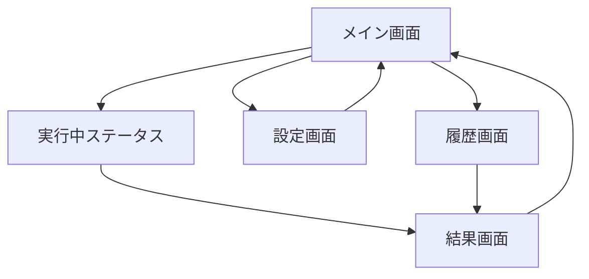

# Sakura VoiceNote v0.2.0 UI設計（画面イメージ付き）

## 1. 目的

- API登録
- YouTube URL入力
- 文字起こし（字幕優先 / 字幕なしはクラウドSTT）
- 外国語→日本語変換
- ファイル保存

を GUI で一連操作できるようにする。

---

## 2. 画面遷移



---

## 3. 画面イメージ（ワイヤーフレーム）

> v0.2.0 では初回セットアップ画面を設けず、設定はメイン画面から設定画面へ遷移して行う。

## 3.1 設定画面

```text
+------------------------------------------------------+
| 設定                                                  |
+------------------------------------------------------+
| OpenAI API Key   [****************************] [👁] |
| Anthropic Key    [............................] [👁] |
| Gemini Key       [............................] [👁] |
| 保存先フォルダ    [D:\...\output              ] [参照] |
|                                                      |
| [接続テスト]                                          |
|                                                      |
| [保存]   [キャンセル]                                 |
+------------------------------------------------------+
```

### 3.1.1 入力項目仕様

| 項目 | 必須 | 既定値 | 保存先 |
| --- | --- | --- | --- |
| OpenAI API Key | 条件付き必須（字幕なし運用時） | 空 | `.env` (`OPENAI_API_KEY`) |
| Anthropic API Key | 任意 | 空 | `.env` (`ANTHROPIC_API_KEY`) |
| Gemini API Key | 任意 | 空 | `.env` (`GEMINI_API_KEY`) |
| 保存先フォルダ | 必須 | `output` | `.env` (`SVN_OUTPUT_DIR`) |

### 3.1.2 バリデーション

1. 保存先フォルダが空の場合は保存不可。
2. 保存先フォルダが作成不能なパスの場合はエラー表示。
3. OpenAI API Key が未設定で「字幕なし運用を許可」の場合は警告ダイアログを表示。
4. `保存` 押下時に `.env` へ反映し、保存結果をトースト表示する。

### 3.1.3 ボタン挙動

- `保存`
  - 設定値を `.env` に保存してメイン画面へ戻る
- `キャンセル`
  - 変更を破棄してメイン画面へ戻る
- `接続テスト`
  - OpenAIキーの有効性を確認し、結果を表示する

## 3.2 メイン画面

```text
+----------------------------------------------------------------+
| Sakura VoiceNote v0.2.0                                        |
+----------------------------------------------------------------+
| YouTube URL                                                     |
| [https://www.youtube.com/watch?v=............................] |
|                                                                |
| [✓] 日本語翻訳を行う    [✓] 要約を生成する                     |
| [ ] 字幕のみ許可（字幕なし時は失敗）                           |
|                                                                |
| [解析開始] [停止] [設定] [保存先を開く]                        |
|                                                                |
| ステータス: 字幕確認中...                                      |
| ログ:                                                          |
| - URL検証OK                                                    |
| - 字幕トラック探索中                                           |
+----------------------------------------------------------------+
```

## 3.3 結果画面

```text
+----------------------------------------------------------------+
| 実行結果                                                        |
+----------------------------------------------------------------+
| URL: https://www.youtube.com/watch?v=...                       |
| 文字起こしソース: subtitles / cloud_stt                         |
| 検出言語: en                                                    |
|                                                                |
| 生成ファイル                                                    |
| - 20260531xxxxxx_transcript.txt      [開く]                    |
| - 20260531xxxxxx_transcript_ja.txt   [開く]                    |
| - 20260531xxxxxx_summary.md          [開く]                    |
| - 20260531xxxxxx_metadata.json       [開く]                    |
|                                                                |
| [フォルダを開く] [同じ設定で再実行] [閉じる]                   |
+----------------------------------------------------------------+
```

## 4. 操作仕様（最小）

1. URL入力後 `解析開始` を押すと実行開始。
2. 字幕ありなら `subtitles` 経路で処理。
3. 字幕なしなら `cloud_stt` 経路で処理。
4. 翻訳ON時は `transcript_ja.txt` 出力。
5. 要約ON時は `summary.md` 出力。
6. 常に `metadata.json` を出力。

---

## 5. エラー表示仕様

- APIキー未設定 + 字幕なし:
  - `字幕が見つからず、APIキー未設定のため音声文字起こしを実行できません。設定画面でAPIキーを登録してください。`
- URL不正:
  - `YouTube URL形式が不正です。https://www.youtube.com/watch?v=... 形式で入力してください。`
- STT未対応形式:
  - `この音声形式は現在のSTTで未対応です。字幕付き動画か別URLで再試行してください。`

---

## 6. 受け入れ基準（UI）

1. API登録後、メイン画面へ遷移できる。
2. URL入力→解析開始で進捗表示が更新される。
3. 実行完了後にファイル一覧が表示される。
4. 保存先フォルダをワンクリックで開ける。
5. エラー時に次アクションが明示される。
6. メイン画面から設定画面へ遷移してAPIキーを更新できる。

---

以上。
