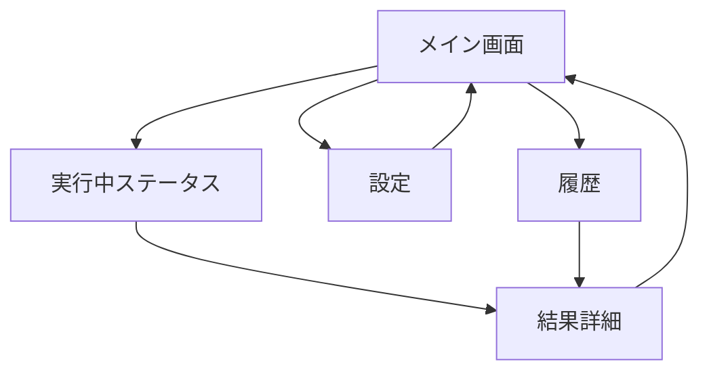

# Sakura VoiceNote v0.2.0 UI運用設計

## 1. 文書情報

- 文書名: Sakura VoiceNote v0.2.0 UI運用設計
- 作成日: 2026-05-31
- 対象: `Sakura VoiceNote v0.2.0`
- 前提: 方式1（クライアント直API） / ffmpeg同梱廃止 / 現行v0.1.2固定

---

## 2. 目的

以下の操作を GUI で完結させる。

1. APIキー登録
2. YouTube URL入力
3. 文字起こし実行（字幕優先 / 字幕なし時はクラウドSTT）
4. 外国語 → 日本語変換
5. ファイル保存

---

## 3. 画面構成

## 3.1 画面一覧

1. メイン画面（実行画面）
2. 設定画面
3. 実行結果画面（詳細）
4. ログ/履歴画面

## 3.2 画面遷移

---

## 4. 画面仕様

## 4.1 設定画面

### 目的

- APIキーと出力フォルダを設定・更新する。

### 入力項目

- OpenAI API Key（必須）
- Anthropic API Key（任意）
- Gemini API Key（任意）
- 保存先フォルダ（既定: `output`）

### 設定画面のボタン

- `保存`
- `キャンセル`
- `接続テスト`

### バリデーション

- OpenAIキー未入力で `字幕なし動画対応` をONにしている場合は警告。
- 保存先パスが無効な場合は保存不可。

---

## 4.2 メイン画面（実行画面）

### レイアウト

- 上段: URL入力エリア
- 中段: 実行オプション
- 下段: 実行ボタン / 進捗 / 保存先表示

### 入力欄

- YouTube URL（必須）

### オプション

- `日本語翻訳を行う`（チェック）
- `要約を生成する`（チェック）
- `字幕のみ許可（字幕なし時は失敗）`（チェック）

### メイン画面のボタン

- `解析開始`
- `停止`
- `設定`
- `保存先を開く`

### ステータス表示

- `待機中`
- `字幕確認中`
- `字幕抽出中`
- `音声取得中（原形式）`
- `クラウドSTT実行中`
- `翻訳中`
- `要約中`
- `保存完了`
- `エラー`

---

## 4.3 実行結果画面

### 表示内容

- 元URL
- 文字起こしソース（`subtitles` / `cloud_stt`）
- 検出言語
- 保存ファイル一覧（リンク）
  - `<timestamp>_transcript.txt`
  - `<timestamp>_transcript_ja.txt`（有効時）
  - `<timestamp>_summary.md`（有効時）
  - `<timestamp>_metadata.json`

### ボタン

- `テキストを開く`
- `フォルダを開く`
- `同じ設定で再実行`

---

## 4.4 ログ/履歴画面

### 表示

- 実行日時
- URL
- 実行結果（成功/失敗）
- ソース（字幕/クラウドSTT）
- 失敗理由（ある場合）

### フィルタ

- 成功のみ
- 失敗のみ
- 日付範囲

---

## 5. 運用設計

## 5.1 APIキー運用

- APIキーは `.env` に保存。
- UI上はマスク表示を既定とする。
- エクスポート機能は提供しない。
- `.env` がない場合は `.env.template` から生成。

## 5.2 実行ルール

1. URL検証
2. 字幕取得トライ
3. 字幕があれば `subtitles` で処理
4. 字幕がなければ音声原形式で取得し `cloud_stt` へ送信
5. 翻訳/要約（選択時）
6. 出力保存

## 5.3 失敗時の運用

- APIキー未設定 + 字幕なし:
  - 実行中断し、設定画面への導線を表示
- ネットワーク障害:
  - リトライ案内（再試行ボタン）
- URL不正:
  - 入力欄の下に具体例を表示

---

## 6. 音声形式の扱い（ffmpeg廃止対応）

- 音声は `m4a/webm/opus` 等の原形式で取得する。
- `mp3` 変換は標準機能にしない。
- STT APIが受け付けない形式の場合のみエラー表示。

エラーメッセージ例:

- `この音声形式は現在のSTTで未対応です。別動画で再試行するか、字幕付き動画をご利用ください。`

---

## 7. 受け入れ基準（UI）

1. 初回起動でAPI登録画面は表示しない。
2. URL入力から1クリックで実行開始できる。
3. ステータスが処理段階ごとに更新される。
4. 結果画面で保存ファイルへ直接アクセスできる。
5. API未設定時の失敗理由と次アクションが明確。

---

## 8. 実装優先順

1. メイン画面（URL入力・実行）
2. 設定画面（API登録）
3. ステータス表示
4. 結果画面
5. 履歴画面

---

## 9. 補足（拡張余地）

- 複数URLのキュー実行
- 保存先テンプレートの切替
- APIプロバイダ自動選択（OpenAI優先→他へフォールバック）

---

以上。
